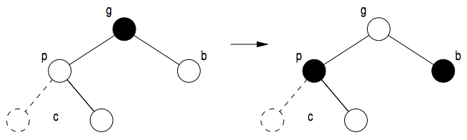
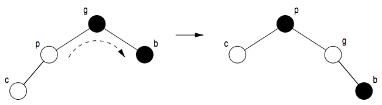
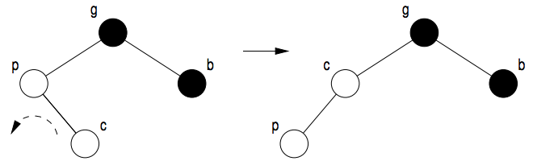

# red-black trees

The characteristics of a red-black tree are as follows:

1. Each node has the color of red or black
2. The color of a virtual node (a node that has the value of a nullptr) is black
3. A red node always has two black children.
4. Each possible route from a node to a virtual node has to have the same number of black nodes. This number is called the black height of a node.
5. The root is black. This is not necessary per se, but makes the process of maintaining a red-black tree easier.

Red-black tree search, add and delete by using bottom-up and top-down are coded and explained in this repository. Cases will be used to explain how red-black trees can keep their characteristics. The cases described below also count in case the tree is mirrored (left part becomes right part and vice versa).

## bottom-up add

In bottom-up add, the characteristics of the red-black tree are only violated if a node is added as a child of a red node. This is the case since an added node is always red which means that the parent of the added node is red an only has one black child. This violates rule three of a red-black tree its characteristics.

The three following cases are used to resolve this violation:

### case 1

### case 2

### case 3

After case three is executed, it becomes case 2.